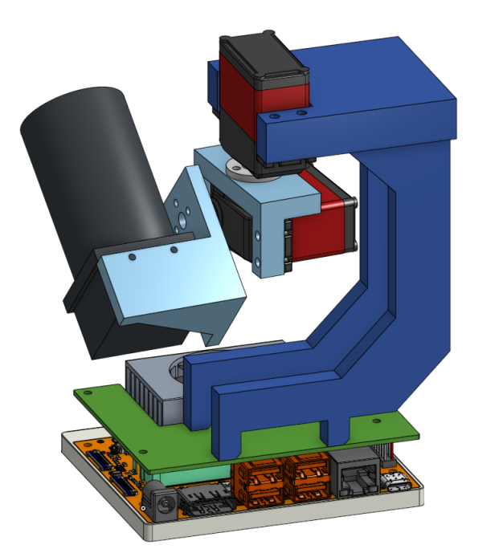

    
   

<h1 align="center">
   RoCam: High Performance Vision-Guided Rocket Tracker  
</h1>

**Developer Names**: Zifan Si, Jianqing Liu, Mike Chen, Xiaotian Lou  
**Supervisor**: Shahin Sirouspour  

Date of project start: September 8th 2025  

**Project Overview**: The goal of this project is to design and implement a deployable camera tracking system capable of autonomously locking onto and following extremely fast-moving model rockets. The system integrates computer vision, motion control, and a web-based operator interface to deliver smooth, stable video (1080p @ 60fps) of critical rocket events such as staging and parachute deployment.  

This project builds a software stack that interfaces with low-cost hardware for small-scale launches (200m apogee) and is scalable to support the McMaster Rocketry Team’s high-powered rockets (3km+ apogee).  

---

### **Key Features**  

1. **Gimbal Motion Control**
   - Real-time two-axis gimbal control.
   - Closed-loop predictive control system for smooth and accurate motion.

2. **Computer Vision Pipeline**
   - Detects and tracks fast-moving objects in real time.
   - Maintains lock even with partial occlusion.
   - Digital zooming and stablization.

3. **Web Application**
   - Live video feed preview.
   - Operator controls for manual override and tracking adjustments.
   - Start/stop video recording, playback, and download.

4. **System Integration & Deployment**
   - Real-time tracking video output at 1080p/60fps.
   - Reliable and scalable for both small-scale and high-powered rocket launches.
   - Designed for ease of use, testing, and future expansion.

---

The folders and files for this project are as follows:  

- **docs** - Project documentation, design notes, diagrams
- **refs** - Reference materials (papers, hardware specs, related work)
- **src** - Source code for embedded system, CV pipeline, and web app
- **test** - Test cases, simulation data, and validation results
